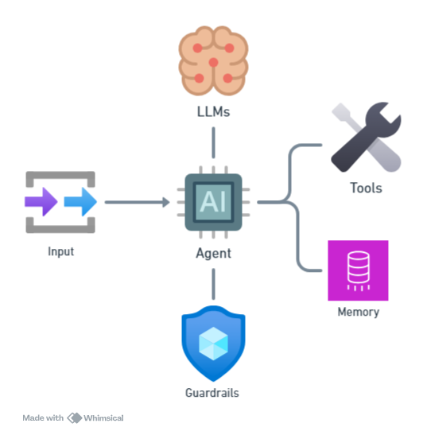

# **What is AI Agent?**

## **Overview of AI Agent**
AI Agent merupakan entitas AI (program/sistem) yang melakukan tugas tertentu secara otomatis, biasanya dalam domain yang cukup spesifik dan dengan aturan atau alur kerja yang telah ditetapkan. Ia bisa merespons input, melakukan aksi berdasarkan skenario tertentu, dan seringkali memerlukan trigger atau arahan dari manusia. ([AI21][6])

---

## **Components of AI Agent**

Gambar diatas merupakan komponen-komponen utama pembangun sebuah *AI Agent*:

* **Input** — data atau permintaan dari pengguna / lingkungan
* **LLMs (Large Language Models)** — inti pemahaman dan *generation* (berpikir / reasoning)
* **Tools** — alat / fungsi yang bisa dipanggil untuk menyelesaikan aksi spesifik
* **Memory** — penyimpanan informasi dari masa lalu untuk data, konteks, personalisasi, dan kesinambungan
* **Guardrails** — lapisan pengaman (aturan, batasan) agar agent tidak melakukan sesuatu yang tidak diinginkan

Berikut fungsi dan pentingnya masing-masing komponen:

| Komponen             | Fungsi / Peran                                                                                                                                                                                                                                                                                                  |
| -------------------- | --------------------------------------------------------------------------------------------------------------------------------------------------------------------------------------------------------------------------------------------------------------------------------------------------------------- |
| **LLMs**             | Sebagai “otak” agent: memproses input → memahami konteks → merumuskan respons / keputusan. Ini termasuk reasoning, perencanaan, inferensi. ([livechatai.com][1])                                                                                                                                                |
| **Input / Persepsi** | Agent perlu mendapat informasi dari luar (pengguna, API, sensor, data environment) supaya bisa merespons atau bertindak berdasarkan situasi terkini. ([rivista.ai][2])                                                                                                                                          |
| **Tools**            | Memungkinkan agent melakukan aksi konkret (contoh: mengambil data lewat API, menjalankan fungsi eksternal, mengakses database). Tools ini memperluas kemampuan agent di luar generasi teks sederhana. ([livechatai.com][1])                                                                                     |
| **Memory**           | Penting agar agent tidak “hilang konteks.” Ada short-term memory (untuk percakapan atau aksi berjalan), long-term memory (untuk menyimpan preferensi, pengalaman masa lalu), kadang ada episodic memory. Memory mendukung kontinuitas, personalisasi, dan belajar dari pengalaman. ([Intelligence Strategy][3]) |
| **Guardrails**       | Pengamanan agar agent tetap aman, etis, dan sesuai tujuan. Bisa berupa aturan otomatis, validasi input/output, pembatasan penggunaan tool, mekanisme koreksi bila agent keluar dari batasan yang diizinkan. ([GoCodeo][4])                                                                                      |

---

### Bagaimana Komponen-Komponen Ini Berinteraksi

Secara garis besar, alur sistem kerja agent kira-kira sebagai berikut:

1. **Persepsi / Input** masuk → agent melihat/mendengar/terima permintaan dari user atau environment.
2. **LLMs / reasoning / decision logic** memproses input, membaca memory untuk konteks lama, menimbang opsi, merencanakan langkah apa yang harus diambil.
3. Jika diperlukan, agent memanggil **tools** untuk melakukan aksi nyata (akses data, operasi API, dll).
4. **Memory** diperbarui: menyimpan hasil, keputusan, input/output supaya di masa depan agent bisa lebih baik atau mempertahankan konteks.
5. Di sepanjang proses, **guardrails** aktif menjaga bahwa agent tidak melakukan tindakan yang melanggar kebijakan, aman, valid, tidak bias, etc.

---

### Kenapa Komponen-Komponen Itu Penting

* Tanpa memory, agent jadi “stateless” → tidak punya kapasitas untuk mempertahankan konteks antar interaksi, pengalaman, atau preferensi pengguna. ([Intelligence Strategy][3])
* Tanpa tools / fungsi eksternal, kemampuan aksi agent terbatas hanya pada generasi teks/ide, tidak bisa melakukan tindakan nyata di dunia luar. ([livechatai.com][1])
* Tanpa guardrails, risiko agent melakukan kesalahan, keluar dari batasan etika / keamanan / privasi sangat tinggi. ([arXiv][5])

---

## **Korelasi Dengan Agentic AI**

Dari berbagai sumber, berikut bagaimana kedua konsep ini saling berkaitan:

| Aspek                       | Bagaimana AI Agent terkait dengan Agentic AI                                                                                                                                                                                                                                                                                                                                                                       |
| --------------------------- | ------------------------------------------------------------------------------------------------------------------------------------------------------------------------------------------------------------------------------------------------------------------------------------------------------------------------------------------------------------------------------------------------------------------ |
| **Sub-komponen**            | Sebuah *AI Agent* bisa menjadi bagian dari sistem *Agentic AI*. Artinya, Agentic AI sering **menggunakan banyak AI agents** untuk menangani berbagai sub-tugas dalam workflow yang lebih kompleks. ([scrapeless.com][9])                                                                                                                                                                                           |
| **Skala & Kompleksitas**    | AI agent biasanya lebih terbatas pada tugas tunggal atau domain yang spesifik; Agentic AI mengangkat level kompleksitasnya, mengoordinasikan banyak agent, memecah tugas ke sub-tugas, dan mengelola dependensi serta interaksi antar agen. ([scrapeless.com][9])                                                                                                                                                  |
| **Otonomi & Adaptasi**      | AI agent bisa punya otonomi dalam lingkup tugasnya (misalnya menentukan bagaimana menyelesaikan tugas berdasarkan input), tetapi seringnya tidak punya otonomi tinggi / tidak selalu adaptif ke kondisi di luar skenario yang dilatih. Agentic AI menekankan adaptasi, pembelajaran terus-menerus, merespons kondisi baru, dan bahkan menghasilkan strategi sendiri untuk mencapai tujuan akhir. ([Freshworks][4]) |
| **Tujuan & Perencanaan**    | AI Agent lebih cenderung mempunyai tujuan kecil atau tugas langsung (contoh: menjawab email, melakukan scheduling, menjawab FAQ). Agentic AI mengandung kemampuan untuk menyusun tujuan jangka panjang, merencanakan aksi multi-langkah, dan menyusun taktik / strategi untuk mencapai tujuan tersebut. ([AI21][7])                                                                                                |
| **Koordinasi & Orkestrasi** | Agentic AI biasanya memiliki lapisan orkestrasi (orchestration layer) yang mengatur interaksi antar agen-agen, memonitor progres, memberikan supervisi bila perlu, mengatur kolaborasi agen agen agar mencapai hasil yang harmonis. AI agents sendiri mungkin bekerja independen jika tidak dalam sistem Agentic AI. ([scrapeless.com][9])                                                                         |

---

[1]: https://livechatai.com/blog/llm-agent-frameworks?utm_source=chatgpt.com "LLM Agent Frameworks for Autonomous AI (2025 Guide)"
[2]: https://www.rivista.ai/wp-content/uploads/2024/07/2402.16631v2.pdf?utm_source=chatgpt.com "1"
[3]: https://www.intelligencestrategy.org/blog-posts/agentic-ai-components?utm_source=chatgpt.com "Agentic AI: Components - Intelligence Strategy Institute"
[4]: https://www.gocodeo.com/post/security-and-isolation-considerations-when-building-with-ai-agent-frameworks?utm_source=chatgpt.com "Security and Isolation Considerations When Building with AI Agent Frameworks"
[5]: https://arxiv.org/abs/2505.03574?utm_source=chatgpt.com "LlamaFirewall: An open source guardrail system for building secure AI agents"
[6]: https://www.ai21.com/knowledge/ai-agent-vs-agentic-ai/?utm_source=chatgpt.com

[7]: https://www.ai21.com/knowledge/ai-agent-vs-agentic-ai/?utm_source=chatgpt.com "AI Agent vs. Agentic AI: What’s the Difference? | AI21"
[8]: https://www.pwc.com/m1/en/publications/documents/2024/agentic-ai-the-new-frontier-in-genai-an-executive-playbook.pdf?utm_source=chatgpt.com "Agentic AI"
[9]: https://www.scrapeless.com/en/blog/ai-agent-vs-agentic-ai?utm_source=chatgpt.com "AI Agent vs. Agentic AI: Data-driven Intelligent Evolution and Scrapeless Solutions"
[10]: https://www.freshworks.com/freshdesk/ai-agent/vs-agentic-ai/?utm_source=chatgpt.com "Agentic AI vs AI Agents: Key Differences Explained"