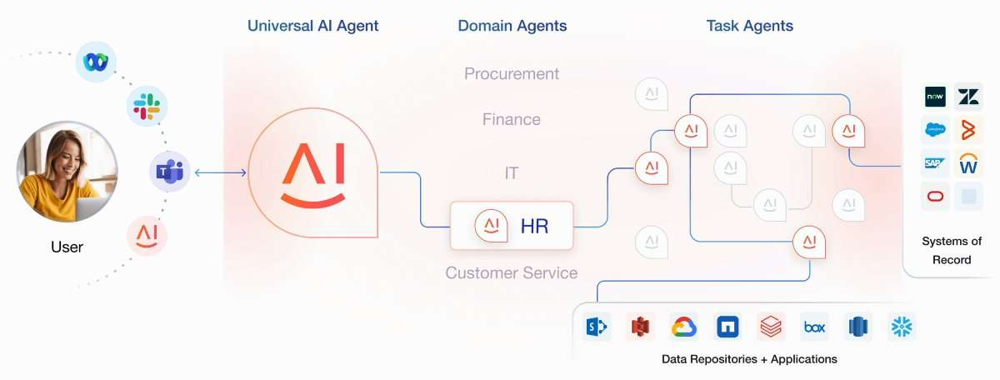
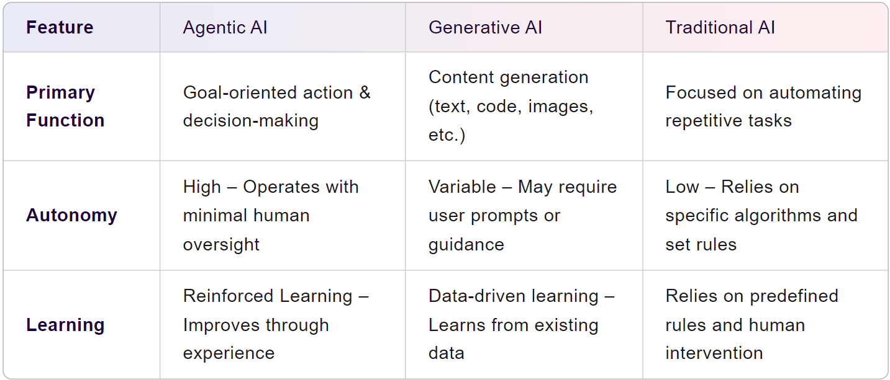

# **Introduction of Agentic AI**

## **Overview of Agentic AI**
Secara umum, *Agentic AI* adalah sistem kecerdasan buatan yang *lebih dari sekadar* merespons permintaan (prompt). Ia memiliki kemampuan untuk:

* Berperilaku secara **autonom** (mandiri), artinya bisa melakukan tindakan tanpa arahan manusia di setiap langkah — manusia menyediakan tujuan / konteks, dan AI ini bekerja untuk mencapainya. ([TechTarget][1])
* Mengambil keputusan sendiri berdasarkan pemahaman konteks dan data lingkungan (termasuk umpan balik). ([AtScale][2])
* Merencanakan / membagi tugas menjadi subtugas, beradaptasi jika keadaan berubah, belajar dari interaksi / hasil sebelumnya (“learning / feedback loops”). ([atfinity.swiss][3])
* Berinteraksi tidak hanya dengan permintaan manusia, tetapi juga dengan sistem, alat/aplikasi lain (API, sensor, database, dsb), sehingga bisa bertindak dalam lingkungan nyata atau sistem informasi. ([Solo.io][4])

---

## **Pengertian Menurut Beberapa Ahli / Organisasi / Artikel**

Berikut definisi atau penjelasan *Agentic AI* dari beberapa sumber:

| Sumber                          | Definisi / Penjelasan                                                                                                                                                                                                                                        |
| ------------------------------- | ------------------------------------------------------------------------------------------------------------------------------------------------------------------------------------------------------------------------------------------------------------ |
| **IBM – “What is Agentic AI?”** | “Agentic AI adalah sistem AI yang bisa mencapai tujuan spesifik dengan supervisi terbatas. Terdiri dari agen-AI — model pembelajaran mesin yang meniru pengambilan keputusan manusia untuk menyelesaikan masalah secara real time.” ([IBM][5])               |
| **Salesforce (Agentforce)**     | AI yang menggunakan agen-memandu mandiri — model yang menyelesaikan tugas secara otomatis dan mengelola alur kerja, membuat keputusan waktu nyata berdasarkan algoritma dan analitik prediktif. ([Salesforce][6])                                            |
| **Atfinity**                    | AI yang dirancang untuk beroperasi secara autonom, mengejar tujuan, membuat keputusan independen, serta berinteraksi secara dinamis dengan lingkungan atau sistem lain untuk mencapai tujuan. ([atfinity.swiss][3])                                          |
| **TechTarget**                  | Sistem AI yang mampu mengambil tindakan dan keputusan secara mandiri, menangani situasi kompleks, dan menyesuaikan perilakunya secara otomatis berdasarkan data lingkungan. ([TechTarget][1])                                                                |
| **McKinsey / Solo.io**          | Menurut Solo.io, Agentic AI adalah sistem berbasis model generatif AI (foundation model) yang bisa bertindak di dunia nyata dan mengeksekusi proses multi-langkah. ([Solo.io][4])                                                                            |
| **Endava**                      | AI dengan otonomi yang lebih tinggi, kemampuan pengambilan keputusan & adaptasi; AI yang diberikan persona, belajar dari data, memodifikasi perilaku seiring waktu; mengejar goal kompleks dan workflow dengan supervisi manusia terbatas. ([endava.com][7]) |

---

## **Karakteristik / Elemen Penting dari Agentic AI**

Dari berbagai definisi tersebut, ada beberapa elemen yang sering muncul sebagai ciri *Agentic AI*:

1. **Autonomi** — tidak terus-menerus diarahkan manusia, bisa mengambil inisiatif. ([TechTarget][1])
2. **Penetapan Tujuan (Goal-driven)** — sistem diberi tujuan tinggi dan bisa bekerja menuju tujuan tersebut. ([Solo.io][4])
3. **Perencanaan & Pemecahan Tugas** — membagi tugas besar menjadi subtugas, merencanakan, dan menyusun strategi. ([atfinity.swiss][3])
4. **Adaptabilitas / Belajar dari Umpan Balik** — mampu menyesuaikan tindakan berdasarkan perubahan data, hasil, atau kondisi lingkungan. ([TechTarget][1])
5. **Interaksi dengan Alat / Lingkungan** — penggunaan API, alat eksternal, sensor, sistem lain, bukan hanya menghasilkan output teks/statistik. ([Salesforce][6])
6. **Kesadaran Konteks (Context Awareness)** — memahami lingkungan kerja atau domain, mempertimbangkan konteks dalam membuat keputusan/tindakan. ([AtScale][2])

---

## **Perbandingan Singkat: Agentic AI vs AI Tradisional / Generatif AI**

Gambar diatas menampilkan **perbandingan tiga jenis AI**: **Agentic AI**, **Generative AI**, dan **Traditional AI**, dilihat dari tiga aspek utama yaitu *Primary Function (Fungsi Utama)*, *Autonomy (Tingkat Otonomi)*, dan *Learning (Pembelajaran)*.

---

### **Primary Function (Fungsi Utama)**

* **Agentic AI** → Fokus pada **aksi dan pengambilan keputusan yang berorientasi tujuan**. AI ini tidak hanya merespons, tetapi aktif mencapai suatu target.
* **Generative AI** → Fokus pada **pembuatan konten** (teks, kode, gambar, video, dsb.) berdasarkan data latih.
* **Traditional AI** → Fokus pada **otomatisasi tugas repetitif** sesuai algoritma/rule yang sudah ditentukan.

---

### **Autonomy (Otonomi)**

* **Agentic AI** → **Tinggi**, dapat beroperasi dengan pengawasan manusia yang minimal. Bisa mengambil keputusan sendiri.
* **Generative AI** → **Bervariasi**, karena sering membutuhkan **prompt** atau arahan dari manusia.
* **Traditional AI** → **Rendah**, sangat bergantung pada algoritma dan aturan yang telah diprogram.

---

### **Learning (Pembelajaran)**

* **Agentic AI** → Menggunakan **Reinforced Learning**, artinya belajar dari pengalaman dan memperbaiki kinerja seiring waktu.
* **Generative AI** → Menggunakan **Data-driven learning**, belajar dari data historis/eksisting untuk menghasilkan keluaran baru.
* **Traditional AI** → **Tidak belajar secara dinamis**, hanya mengandalkan aturan yang sudah ditentukan sebelumnya dan membutuhkan intervensi manusia untuk perubahan.

---

[1]: https://www.techtarget.com/searchenterpriseai/definition/agentic-AI?utm_source=chatgpt.com "What Is Agentic AI? Complete Guide | TechTarget"
[2]: https://www.atscale.com/glossary/agentic-ai/?utm_source=chatgpt.com "What is Agentic AI? Definition, Best Practices, Examples | AtScale"
[3]: https://www.atfinity.swiss/glossary/agentic-ai?utm_source=chatgpt.com "What is Agentic AI? Definition and Example | Atfinity"
[4]: https://www.solo.io/topics/ai-infrastructure/what-is-agentic-ai?utm_source=chatgpt.com "What is Agentic AI? Definition, Benefits & Use Cases (2025) | Solo.io"
[5]: https://www.ibm.com/think/topics/agentic-ai?utm_source=chatgpt.com "What is Agentic AI? | IBM"
[6]: https://www.salesforce.com/ap/agentforce/what-is-agentic-ai/?utm_source=chatgpt.com "What is Agentic AI? | Salesforce"
[7]: https://www.endava.com/glossary/agentic-ai?utm_source=chatgpt.com "Agentic AI: Definition, types, applications | Endava"

