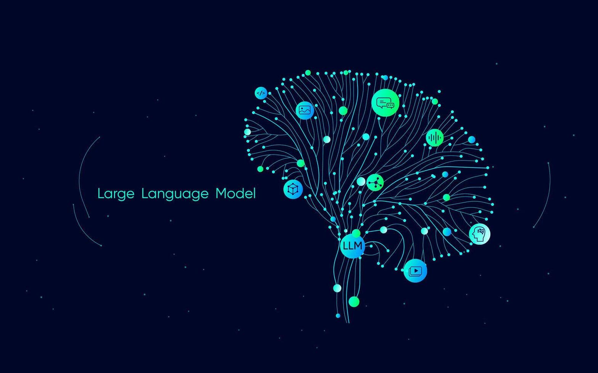
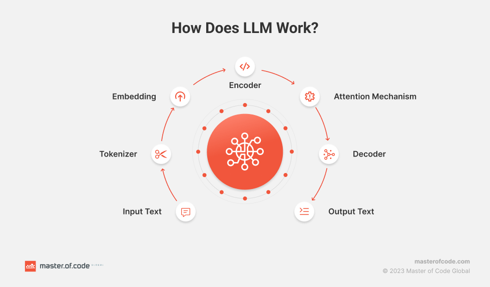

# **Large Language Models (LLMs)**

## **Overview of LLMs**

*Large Language Model* adalah model AI berukuran besar yang dilatih pada sejumlah besar teks dengan metode pembelajaran *self-supervised* atau pra-latih, tanpa label eksplisit, sehingga bisa mempelajari struktur bahasa, semantik, sintaksis, dan pengetahuan tersirat dalam data teks. ([Wikipedia][1])
Fokusnya biasanya pada tugas pemrosesan bahasa alami (NLP): penerjemahan, ringkasan, menjawab pertanyaan, membuat teks kreatif, bahkan kode. ([Swimm][2])

---

## **Cara Kerja Dasar**

Gambar menunjukan langkah-langkah utama LLM saat menerima teks input dan menghasilkan teks output. Berikut tiap tahapannya:

1.  **Input Text**, Pengguna memasukkan teks, misalnya pertanyaan atau perintah.

2.  **Tokenizer**, Teks dipecah menjadi bagian‐bagian kecil yang disebut *token* (bisa kata, subkata, atau karakter tergantung model). Setiap token dikonversi ke bentuk angka (ID token).

3.  **Embedding**, ID token tersebut diubah menjadi vektor numerik (embedding) — vektor yang mewakili makna token dalam ruang dimensi tinggi. Juga ditambah informasi posisi (positional encoding) supaya model “tahu” urutan token dalam kalimat.

4.  **Encoder / Decoder / Mechanism (tergantung arsitektur)**

    1.  Dalam banyak LLM generatif (seperti GPT), model menggunakan bagian decoder-only yang memproses embedding dan menghasilkan token satu-persatu.

    2.  Jika arsitekturnya “encoder-decoder” (seperti di model penerjemahan), input diproses oleh encoder untuk membuat representasi kontekstual, kemudian decoder menggunakannya untuk menghasilkan output.

5.  **Attention Mechanism**, Ini adalah bagian kunci, memungkinkan model memperhatikan bagian lain dari input untuk memahami konteks.

    1.  *Self-attention* → setiap token melihat token-token lain di sekitarnya (termasuk sebelumnya dan sesudahnya dalam input) untuk memahami konteks secara keseluruhan.
   
    2.  *Masked attention* (pada decoder) → ketika menghasilkan output token satu-per-satu, model tidak boleh melihat token yang akan dihasilkan di masa depan (agar tidak “curang”).

6. **Output Text**, Setelah pemrosesan melalui beberapa lapisan (transformer blocks), model memprediksi token selanjutnya berdasarkan probabilitas. Token hasil prediksi kemudian diubah kembali menjadi teks. Proses ini berulang sampai selesai (bisa sampai token “end” atau berdasarkan panjang maksimal).

---

### **Contoh Sederhana Ilustratif**

Bayangkan model mendapati input:

> “Cuaca di Padang hari ini seperti apa?”

Alurnya kira-kira:

* Input → dipecah jadi token: “Cuaca”, “di”, “Padang”, “hari”, “ini”, “seperti”, “apa”, “?”
* Token tersebut → diubah menjadi angka → embedding + posisi
* Attention melihat kata “Cuaca” serta “Padang” dan “hari ini” untuk memahami konteks: model tahu “Padang hari ini” adalah lokasi dan waktu, sehingga konteks cuaca lokal sekarang.
* Decoder / proses prediksi → memproduksi kata satu demi satu, mungkin: “Hari ini cuaca di Padang cerah dengan sedikit awan.”

---

## **Keunggulan / Manfaat**

Beberapa manfaat besar dari LLM antara lain:

1. Interaksi yang lebih natural dengan bahasa manusia — bisa mengerti konteks, idiom, nuansa, dan merespons seolah-olah “mengerti”. 
2. Fleksibilitas tugas: dari teks bebas sampai teknis seperti kode, ringkasan, penerjemahan, menjawab tanya, dll.
3. Hemat dalam pengembangan: karena pra-latihan yang umum, bisa diadaptasi ke domain tertentu tanpa harus mulai dari nol tiap kali.
4. Kapabilitas multibahasa dan gaya (style) yang bisa disesuaikan.

---

## **Tantangan dan Keterbatasan**

Namun, LLM bukan tanpa masalah. Berikut beberapa hal yang perlu diperhatikan:

* **Hallucinations**: output yang terdengar meyakinkan tetapi salah secara fakta atau tidak berdasar.
* **Bias & etika**: jika data latih memiliki bias (gender, budaya, ras, dsb.), model bisa memperkuat atau mereproduksi bias tersebut.
* **Data kedaluwarsa / informasi yang statis**: model pra-latih hanya pada waktu data dikumpulkan; kalau tidak diperbarui, bisa memberikan jawaban yang sudah usang untuk hal-hal terkini.
* **Kebutuhan sumber daya besar**: meliputi komputasi (GPU/TPU), penyimpanan besar, energi, biaya yang tinggi.
* **Kesulitan interpretabilitas**: sering disebut sebagai “black box” — sulit menjelaskan kenapa model memilih output tertentu.

---

## **Tren & Masa Depan**

Beberapa arah pengembangan yang sedang aktif:

* Integrasi dengan **alat eksternal dan basis data** (retrieval-augmented generation / RAG) agar jawaban bisa lebih akurat dan berdasarkan fakta terkini.
* Model multimodal (bukan hanya teks, tapi juga gambar/suara/video) agar memahami dan menghasilkan konten yang lebih beragam.
* Teknik efisiensi: seperti *model compression*, *pruning*, quantization, agar model yang besar bisa lebih ringan dipakai di berbagai perangkat.
* Peningkatan aspek keamanan, fairness, auditabilitas, dan transparansi.

---

[1]: https://en.wikipedia.org/wiki/Large_language_model?utm_source=chatgpt.com "Large language model"
[2]: https://swimm.io/learn/large-language-models/large-language-models-llms-technology-use-cases-and-challenges?utm_source=chatgpt.com "Large Language Models (LLMs): Technology, use cases, and challenges - Swimm"
[3]: https://thetechthinker.com/large-language-model-llm-10-powerful-benefit/?utm_source=chatgpt.com "What is Large Language Model (LLM): 10 Powerful Benefits"
[4]: https://www.microsoft.com/en-us/microsoft-cloud/blog/2024/10/09/5-key-features-and-benefits-of-large-language-models/?utm_source=chatgpt.com "5 key features and benefits of large language models | The Microsoft Cloud Blog"
[5]: https://scisimple.com/en/articles/2025-07-04-the-risks-and-challenges-of-large-language-models--ak5grlx?utm_source=chatgpt.com "The Risks and Challenges of Large Language Models - Simple Science"
[6]: https://simplescience.ai/en/2023-07-19-the-rise-and-challenges-of-large-language-models--ao1go2?utm_source=chatgpt.com "The Rise and Challenges of Large Language Models - Simple Science"
[7]: https://www.analyticsinsight.net/tech-news/challenges-of-building-large-language-models-whats-stopping-developers?utm_source=chatgpt.com "Challenges of Building Large Language Models: What’s Stopping Developers?"
[8]: https://nexos.ai/blog/llm-challenges/?utm_source=chatgpt.com "6 biggest LLM challenges and possible solutions"
[9]: https://www.tome01.com/introduction-to-llms-limitations-challenges-solutions?utm_source=chatgpt.com "Introduction to LLMs - Limitations, Challenges & Solutions | tome01"
[10]: https://arxiv.org/abs/2406.18841?utm_source=chatgpt.com "Navigating LLM Ethics: Advancements, Challenges, and Future Directions"

