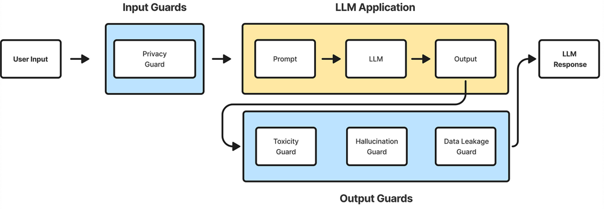

# **Prompt Injection**

---

## **Description**
Kerentanan *Prompt Injection* terjadi ketika prompt mengubah perilaku atau output LLM
dengan cara yang tidak diinginkan. Input tersebut dapat memengaruhi model meskipun tidak terlihat
oleh manusia, oleh karena itu *prompt injection* tidak perlu terlihat/dapat dibaca oleh manusia, asalkan
kontennya diproses oleh model.

Kerentanan *prompt injection* terjadi ketika model dipaksa oleh input agar salah memproses instruksi — misalnya instruksi tersembunyi dari pengguna bisa membuat model melanggar kebijakan, menghasilkan konten berbahaya, memberi akses tanpa izin, atau mempengaruhi keputusan penting. Meskipun teknik seperti **Retrieval Augmented Generation (RAG)** dan *fine-tuning* digunakan agar keluaran LLM lebih relevan dan akurat, penelitian menunjukkan bahwa teknik ini tidak bisa sepenuhnya menghentikan serangan *prompt injection*.

Istilah *prompt injection* dan *jailbreaking* sering digunakan saling bergantian, tapi memiliki makna berbeda. *Prompt injection* adalah manipulasi dengan memasukkan input khusus untuk mengubah perilaku model, termasuk melewati mekanisme keamanan. *Jailbreaking* adalah jenis ekstrem dari *prompt injection* di mana penyerang membuat model mengabaikan seluruh protokol keamanan. Untuk melindungi sistem, pengembang bisa menanamkan batasan pada prompt sistem dan menangani input dengan hati-hati. Namun agar *jailbreaking* benar-benar dicegah, perlu pembaruan terus-menerus pada *training* dan mekanisme keamanan model.

---

## **types of Prompt Injection**
- Direct Prompt Injections, 
terjadi ketika prompt input secara langsung mengubah perilaku
model dengan cara yang tidak diinginkan atau tidak terduga. Input tersebut dapat bersifat
disengaja (misalnya, aktor jahat yang sengaja merancang prompt untuk memanipulasi model)
atau tidak disengaja (misalnya, pengguna secara tidak sengaja memberikan input yang
memicu perilaku yang tidak terduga).

- Indirect Prompt Injections,
terjadi ketika Model Bahasa Besar (LLM) mengambil input dari sumber eksternal — seperti website, email, dokumen, atau file lain — yang mengandung instruksi tersembunyi. Instruksi ini bisa membuat model bertindak cara yang *tidak diinginkan* ketika model memproses konten tersebut. Dampaknya bisa beragam tergantung konteks bisnis dan bagaimana model dirancang. Beberapa risiko umum adalah:
    * Bocornya data sensitif
    * Pengungkapan informasi infrastruktur sistem AI
    * Hasil output yang salah atau bias
    * Akses tidak sah ke fungsi tertentu
    * Perintah arbitrer dijalankan di sistem yang terhubung
    * Proses pengambilan keputusan penting terpengaruh

    Dengan makin berkembangnya AI multimodal (yang memproses teks, gambar, dsb. bersamaan), muncul risiko baru seperti instruksi tersembunyi di dalam gambar atau interaksi antar modality yang sulit dideteksi. Penanganannya butuh penelitian dan pertahanan khusus.

---

## **Prevention and Mitigation Strategies**
Kerentanan prompt injection dapat terjadi karena sifat AI generatif. Mengingat
pengaruh *stochastic* yang mendasari cara kerja model, belum jelas apakah ada metode pencegahan
yang sepenuhnya aman untuk prompt injection. Namun, langkah-langkah berikut dapat mengurangi
dampak prompt injection:

1. *Constrain model behavior*

    Berikan instruksi spesifik mengenai peran, kemampuan, dan batasan model dalam
    prompt sistem. Pastikan kepatuhan ketat terhadap konteks, batasi respons pada tugas atau topik tertentu,
    dan instruksikan model untuk mengabaikan upaya untuk mengubah instruksi inti.

2. *Define and validate expected output formats*

    Tentukan format output yang jelas, minta penjelasan rinci dan kutipan sumber, dan gunakan
    kode deterministik untuk memvalidasi kepatuhan terhadap format-format tersebut.

3. *Implement input and output filtering*

    Tentukan kategori sensitif dan buat aturan untuk mengidentifikasi dan menangani konten semacam hal tersebut.
    Terapkan semantik filter dan *string-checking* untuk memindai konten yang tidak diizinkan. Evaluasi
    respons menggunakan RAG Triad: Evaluasi relevansi konteks, keandalan, dan
    relevansi pertanyaan/jawaban untuk mengidentifikasi output yang berpotensi berbahaya.

    

4. *Enforce privilege control and least privilege access*

    Berikan aplikasi dengan token API-nya sendiri untuk fungsionalitas yang dapat diperluas, dan tangani fungsi-fungsi tersebut dalam kode daripada memberikannya kepada model. Batasi hak akses model hanya pada yang diperlukan untuk operasi yang dimaksudkan.

5. *Require human approval for high-risk actions*

    Implementasikan *human-in-the-loop control* (keterlibatan kontrol manusia) untuk operasi yang memerlukan izin khusus guna mencegah tindakan yang tidak sah.

6. *Segregate and identify external content*

    Pisahkan dan tandai dengan jelas konten yang tidak tepercaya untuk membatasi pengaruhnya terhadap prompt pengguna.

7. *Conduct adversarial testing and attack simulations*

    Lakukan *penetration testing* dan *breach simulations* secara rutin, dengan memperlakukan model sebagai
    pengguna yang tidak tepercaya untuk menguji efektivitas batas kepercayaan dan kontrol akses.

---

## **Example Attack Scenarios**

1. *Direct Injection*

    Seorang penyerang menyisipkan perintah ke dalam chatbot layanan pelanggan, memerintahkannya untuk mengabaikan
    pedoman, mengakses basis data pribadi, dan mengirim email, yang mengakibatkan akses tidak sah
    dan eskalasi hak akses.

2. *Indirect Injection*

    Seorang pengguna menggunakan LLM untuk merangkum sebuah halaman web yang mengandung instruksi tersembunyi yang menyebabkan
    LLM menyisipkan gambar yang mengarah ke URL, yang mengakibatkan kebocoran data pribadi.

3. *Unintentional Injection*

    Seorang pelamar menggunakan LLM untuk menyempurnakan resume-nya — dan secara tidak sengaja memicu sinyal bahwa resume itu dibuat oleh AI sesuai kebijakan perusahaan.

4. *Intentional Model Influence*

    Seorang penyerang memodifikasi dokumen dalam repositori yang digunakan aplikasi untuk Retrieval-Augmented Generation
    (RAG). Ketika *query* mengembalikan konten yang dimodifikasi, instruksi berbahaya tersebut mengubah output LLM, menghasilkan hasil yang menyesatkan.